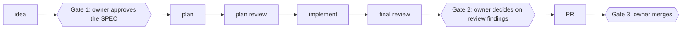

# Spec-Driven Workflow

[](https://github.com/wojciechczarnecki/agentic-pipeline/actions/workflows/ci.yml) [](LICENSE) [](plugin/CHANGELOG.md)

A Claude Code plugin that takes a feature from an approved spec to a reviewed pull request, with owner gates between the stages and a command guard that stops the agent from pushing to main, merging its own PR or touching the production hosts you configure.

Three names, one thing: *Spec-Driven Workflow* is the project, `agentic-pipeline` is the
repository and `pipeline` is the plugin (the `/pipeline:*` commands, installed as
`pipeline@wcz-tools`).

## How it works



You write the spec with the agent in a dialogue (`/pipeline:idea`) and approve it. From
there `/pipeline:ship` runs every stage as a subagent with fresh context: a plan, an
adversarial review of the plan, the implementation step by step in a self-correction loop,
and a final review from three perspectives. You come back when a stage escalates and when
the review findings are ready; the agent then applies your decisions, opens the pull
request and waits for green CI. The merge stays yours. Every spec keeps its state and
workflow metrics in its own frontmatter, checked by `workflow_metrics.py --check`.

## The guard in action

A `PreToolUse` hook reads every shell command the agent is about to run and refuses the
ones that belong to the owner:

```text
$ git push origin main
Blocked by the pipeline guard: pushing to main: main changes only through a PR merged by the owner; work on a feature branch
```

The guard is best effort, not a sandbox: it reads commands as text, and GitHub rulesets
and a `pre-push` hook stand behind it. Its three layers, the commands it stops that a
string `deny` rule lets through, and its known limits are in
[plugin/docs/GUARD.md](plugin/docs/GUARD.md).

## What sets it apart

Most spec-driven tools plan: they turn an idea into a specification, a plan and tasks, and
trust the agent from there. Some add approval gates. This plugin enforces: a command guard
refuses the shell commands an agent should never run on its own — a push to `main`,
merging its own pull request and, once you list them in `.claude/workflow.json`, touching
your production hosts or running an Alembic migration against a non-local database — and
every spec carries a `metrics:` block that a script rejects when a stage left it
incomplete.

## Requirements & opinions

The plugin is opinionated about the setup around it:

- **GitHub with the `gh` CLI** — the agent opens pull requests and reads CI with `gh`.
- **Squash merges** — pull requests are squash merged, so one pull request becomes one
  commit on `main`.
- **GitHub rulesets** — the server-side layer: the `main` ruleset requires a pull request
  and a green check, whatever happens on the machine.
- **`python3` on the machine** — the hooks run on the standard library alone; without
  `python3` they fail open, with a warning, and guard nothing.
- **Migration guarding is Alembic only** — a project on another migration tool gets no
  protection there.

### Who it is for

- A developer who owns a repository and wants Claude Code to deliver whole features while
  keeping the spec, the review decisions and the merge.
- Projects on GitHub where a pull request with green CI is already the way into `main`.

### Who it is not for

- Teams that want the agent to merge on its own or to deploy.
- Projects outside GitHub, or without `python3` where Claude Code runs.
- Anyone looking for a sandbox: the guard is a guardrail for a cooperative agent, not a
  security boundary.

## What's deliberately not here

- **No runtime dependencies** — hooks and scripts use the Python standard library only.
- **No hosting outside Claude Code** — the pipeline runs as a Claude Code plugin, not as a
  service or a CLI of its own.
- **No sandbox** — the guard is best effort; what it does not see is listed in
  [its known limits](plugin/docs/GUARD.md#known-limits).

## Install

```bash
claude plugin marketplace add 'https://github.com/wojciechczarnecki/agentic-pipeline.git#stable'
claude plugin install pipeline@wcz-tools --scope user
```

`#stable` is the release channel. Updating, the one-time migration, opting a repository out
and the known traps are in the [install guide](plugin/docs/INSTALL.md).

## Quickstart

Install first ([Install](#install)), then:

```bash
claude            # in your project's directory
/pipeline:init    # inside the session: configuration, documents, git hook, CI
/pipeline:idea    # describe the feature; the dialogue ends in an approved SPEC
```

After the SPEC is approved, `/pipeline:ship NNN` takes it to a pull request.

## Documentation

- [Install guide](plugin/docs/INSTALL.md) — channel, scope, updates, migration, traps
- [The command guard](plugin/docs/GUARD.md) — threat model, layers, known limits
- [Workflow metrics](plugin/README.md#workflow-metrics) — the `metrics:` block and `--check`
- [Plugin documentation](plugin/README.md) — configuration and pipeline mechanics
- [Contributing](CONTRIBUTING.md) and the [security policy](SECURITY.md)
- [Changelog](plugin/CHANGELOG.md) — releases are tagged `pipeline--vX.Y.Z`

## Development

See [CONTRIBUTING.md](CONTRIBUTING.md). The plugin's tests are plain pytest on the standard
library, so they also run outside this project's dev environment, on any interpreter that
has pytest:

```bash
cd plugin && python3 -m pytest tests
```

## License

[MIT](LICENSE)
